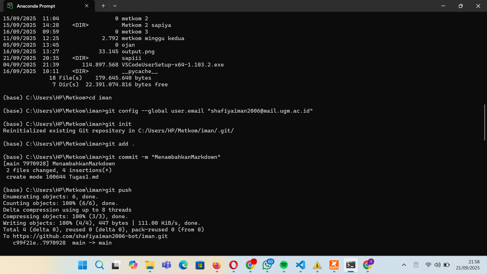
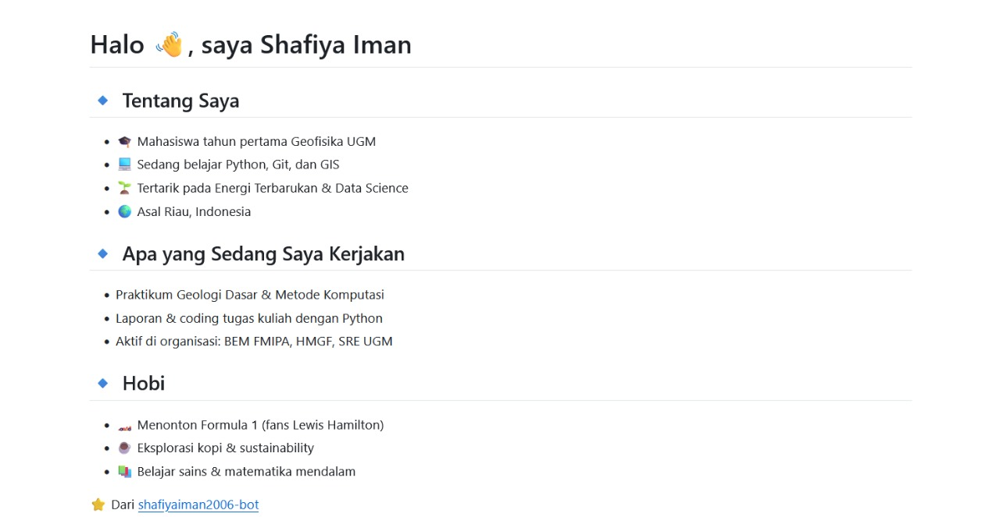

## LAPORAN PRAKTIKUM METODE KOMPUTASI ##

## Apa yang Saya Pelajari
- Belajar perintah dasar Git:  
  - `git clone` = menyalin repository dari GitHub ke komputer.  
  - `git add` = menandai file yang siap disimpan.  
  - `git commit` = menyimpan perubahan sebagai versi baru.  
  - `git push` = mengirim commit dari komputer ke GitHub.  
- Mengerti bahwa Git itu seperti buku catatan versi, jadi setiap perubahan bisa dilacak.

## Apa yang Masih Bingung
- Masih agak bingung dengan konsep branch, fork, dan pull request.  
- Secara keseluruhan, masih butuh banyak latihan supaya lebih terbiasa.

## Gambar Tugas 1

## Gambar Tugas 2 (Membuat Data Diri)

